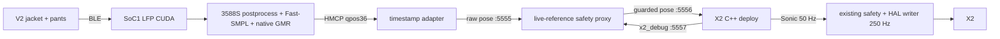

# X2 Garment Powered Integration Gate

Updated: 2026-08-31

## Status

The live-reference integration layer is implemented as an isolated candidate.
Its policy-off robot-debug dependency now passes the exact SoC1 candidate
tests, but it is not yet authorized for a powered garment run. The final
parent still needs the same-binary 300-second supported StandStill acceptance
and an approved manifest. The old direct launcher remains hard-disabled.

### 2026-08-31 M1 SoC1 exact-candidate pass

The patch was synchronized after the post-reboot ownership gate and built in
the isolated workspace `runtime_suspended/ws_ground_debug_20260831`; no
existing install was overwritten. Direct CTest passed `2/2`. The exact
candidate binary is:

```text
3c4dee77b9bde50c304b28200eea030b900ac55f9efc1473543068dbc9c3559f
```

Proxy/manifest tests passed `18/18` on both Mac and SoC1, the v5.1 wire
self-check passed, and the retained garment replay remained fail-closed in
`WARMUP`. In the process/network test the exact candidate used `--dry-run`, so
it created no HAL command publisher while official MC remained the sole owner.
After simulated `load`, its `GROUND_LOAD_HOLD` debug stream drove the proxy
through `WAIT_ROBOT -> WARMUP -> STANDSTILL_READY`.
Test-only startup ramp durations were shortened; this does not replace the
frozen powered launcher or count as a parent balance result.

At READY, robot debug age was `0.008710 s`; guarded StandStill position error
was at most `2.9564e-08 rad`, velocity was exactly zero, and root quaternion
norm was `1.0`. Direct debug ROS timestamps advanced by `0.019989 s` even
though the policy-off control tick remained zero. Source expiry locked out at
`0.153 s`; candidate exit locked out at debug age `0.102 s`. Cleanup left
ports `5555/5556/5557` free and all four command topics with one official
`mc_ros2_node` publisher.

Evidence is retained under
`runtime_suspended/logs/m1_ground_debug_dryrun_20260831_104650/`. Milestone
`M1_PREPOLICY_DEBUG_READY` is complete. This is an interface/process result,
not a powered balance result.

### 2026-08-31 local pre-policy debug patch (historical precursor)

At this precursor stage, the missing `GROUND_LOAD_HOLD` debug publication was
patched in the local source tree only. Local and SoC1 source were first
confirmed identical at
SHA-256 `58417e5e01aafbb273e8825c2639c41466a25805c8eb7522740a0e980cbd578d`.
The patch publishes the existing `x2_debug` schema from measured `RobotState`
and the current held static `SafeCommand` while policy is off. Publication is
suppressed unless the snapshot exists and every HAL state group remains fresh;
this prevents cached state from looking fresh merely because debug frames keep
arriving.

Local post-patch identities:

```text
x2_deploy_onnx_ref.cpp
  ea8595a5eb0573e45b501647ee623e50e636911f0ca5501070216eae39d208e9
supported_policy_gates.hpp
  26532959bfaa435f3abde55ca8e2bab8bad141aa36e0e330b1cc4268d855ed62
test_supported_policy.cpp
  bc8532008fe1d9d027b66f35dea35c65a5e0590c6637830335bae9252e69bdd0
```

The standalone C++ test and a clean offline CMake build passed `2/2` tests.
The live-reference proxy and parent-manifest suites passed `18/18` tests. At
that time no file had been uploaded to SoC1, no robot runtime had been built or
replaced, and no MC or HAL process had been touched. The M1 section above
records the later isolated SoC1 promotion and process/network/wire pass.

### 2026-08-31 post-reboot cleanup gate

Before any source synchronization, the operator confirmed the robot was fully
suspended. Read-only inspection then showed that the robot had rebooted about
21 minutes earlier, so the historical `x2_waist_static` tmux session and its
custom deploy/writer no longer existed. No `lifted`, `Ctrl-C`, kill, MC command,
or HAL command was sent.

All leg/waist/arm/head command topics reported exactly one publisher, with the
publisher endpoint owned by `mc_ros2_node`. State rates were approximately
`1001.9/1001.0/1000.4/333.5 Hz`; ports `5555`, `5556`, `5557`, `51234`, and
`51237` had no listeners. No garment, offload, proxy, or custom deploy process
was present. The current session-clean gate is therefore closed by reboot plus
read-only ownership verification. New source may now be staged, but the first
build must remain in a new scratch workspace and must not replace an existing
runtime.

The default historical SoC1 runtime still predates this patch. The validated
scratch candidate above is now the only eligible parent for M2; do not fall
back to the historical install. The proxy must still obtain live robot yaw
from `x2_debug`; identity yaw, cached values, and arming after unguarded policy
entry remain forbidden.

## Battery Change Or Reboot

A battery change or robot reboot invalidates the complete live-reference
session. Never reuse an old ready sentinel, arm request, proxy status, parent
approval result, or cached debug frame.

Before staging this line again, perform a read-only audit on SoC1:

1. Check for any existing `x2_deploy_onnx_ref`, garment, offload, adapter, or
   live-reference proxy process.
2. Check listeners on ports `5555`, `5556`, `5557`, `51234`, and `51237`.
3. Inspect publisher ownership for the leg, waist, and arm HAL command topics.
4. If another control session has registered an `x2_deploy_onnx_ref`
   publisher, do not upload, test, or start this line until that session has
   exited and ownership has been audited again.
5. Create a new source calibration epoch, proxy session, and arm request. The
   approved parent hashes remain reusable only when all pinned files still
   match; the runtime session itself never survives a reboot.

File transfer and process-level ZMQ tests are deferred while any other custom
controller is present, including a writer-suppressed STANDBY process. This
avoids adding load or changing files underneath a powered-control session.

## Frozen Topology



Only the adapter/proxy boundary changed. Garment mapping, HMCP, offload,
Sonic model, gains, pelvis reconstruction, 50 Hz policy rate, and 250 Hz
writer remain frozen.

## What Is Already Proven

- Live garments through the pipelined 3588S offload produced `35.02 Hz` with
  `30.5 ms` p95 and `46.6 ms` maximum source gaps.
- Corrected C++ Sonic ran at 50 Hz in dry-run with no custom HAL publisher.
- Intentional reference loss stopped HMCP and drove the existing C++ watchdog
  into `SAFE_IDLE` about `0.518 s` after the final frame.
- Offline entry analysis proved freshness alone is unsafe: the captured entry
  had about `-115.9 deg` uncorrected yaw mismatch and was moving; the quietest
  window was calibration T-Pose.

These results prove compute/transport and fail-closed starvation behavior.
They do not prove powered live-reference balance.

## Proxy Contract

`scripts/garment_zmq/gate_live_reference.py` owns the only path from raw
`:5555` to Sonic `:5556`.

```text
WAIT_SOURCE / WAIT_ROBOT
  -> WARMUP
  -> STANDSTILL_READY
  -> explicit ARM_LIVE_REFERENCE
  -> BLEND (10 s)
  -> LIVE

any post-warmup source/debug/wire/stationary fault -> LOCKOUT
```

`LOCKOUT` is terminal. Fresh frames returning do not resume output. Restarting
the proxy creates a new session and requires the complete warmup again.

Before `STANDSTILL_READY`, the proxy publishes nothing. Readiness requires:

- strict v5 timestamp reference with the proven live-edge future window;
- fresh raw reference (`<=0.15 s`) and fresh `x2_debug` (`<=0.10 s`);
- powered debug (`dry_run=0`);
- at least 50 accepted frames and two continuous seconds of stillness;
- neutral joint offsets from trained StandStill, including an arm envelope
  that rejects calibration T-Pose;
- bounded per-group reference velocity and root roll/pitch/angular speed.

In `STANDSTILL_READY`, output is exactly the trained 31-joint StandStill
reference, zero reference velocity, and a frozen yaw-only quaternion captured
from the robot. The live garment joints are not yet visible to Sonic.

On explicit arm, the proxy captures one constant transform:

```text
yaw_delta = robot_yaw - wearer_yaw
```

It pre-multiplies every live root quaternion by that yaw transform and uses
one smoothstep alpha for current joints, joint velocity, root quaternion, and
all nine future slots. At alpha zero the bytes describe anchored StandStill;
at alpha one they describe the yaw-rebased live reference. The first powered
mode is stationary-only: wearer motion outside the entry envelope locks the
session instead of becoming teleoperation.

## Source-Only Launcher

Run only on SoC1 after the 3588S reference server is ready:

```bash
cd ~/projects/x2_sonic_migrated_20260826/sonic_x2_transfer_v2/GR00T_audit/gear_sonic_deploy
./run_x2_garment_offload_source.sh
```

The launcher preserves the passing settings:

```text
LFP=local CUDA
Fast-SMPL=CPU
GMR=native, max_iter=2, damping=1.0
PyTorch/OMP/BLAS threads=1
3588S pipeline=enabled
pose_scale=0.7
velocity=timestamp
raw output=tcp://127.0.0.1:5555
```

It waits for both garments, asks the operator to type `TPOSE`, requires at
least 30 Hz, then remains source-only. It does not source ROS, launch C++, stop
MC, or create a HAL publisher.

## Proxy Staging

This command may be staged now, but it will correctly remain in `WAIT_ROBOT`
until a compatible C++ parent publishes powered debug while policy is off:

```bash
/agibot/data/home/agi/miniconda3/envs/teleop/bin/python -u \
  scripts/garment_zmq/gate_live_reference.py \
  --source-port 5555 --robot-port 5557 --output-port 5556 \
  --status-file /tmp/x2_live_reference_gate.status.json
```

Do not pass `--allow-dry-run-debug` in a powered workflow. That option exists
only for isolated network tests.

## Parent Approval Gate

Live arming additionally requires:

```text
approved_manifests/x2_fixed_standstill_parent.json
```

No approved file exists yet. The `.example.json` file is deliberately marked
`not-approved` and cannot pass validation. A real manifest must pin:

- deploy binary, model, powered launcher, and profile launcher SHA-256;
- v0.9 / aimdk_msgs 0.8.18 / StandStill / neutral_damped identity;
- reconstructed pelvis, 50 Hz policy, and 250 Hz writer;
- three distinct supported 30-second passes;
- one supported 300-second pass;
- an explicit approval identity, time, scope, and note.

Only after both the manifest and proxy state exist may the operator use:

```bash
./arm_x2_supported_garment_live.sh X2_ARM_SUPPORTED_GARMENT_LIVE_REFERENCE
```

That script starts no controller. It validates the manifest and live proxy
status, writes one session-bound arm request with exclusive creation, and
waits for `BLEND`. It cannot request a second arm in the same session.

## Current Blocker To Close

The policy-off debug interface and exact-candidate proxy validation are now
complete. The fixed-reference control line owns the remaining prerequisites:

1. Retain the already accepted distinct 30-second supported evidence; do not
   repeat an identical 30-second probe.
2. Run one 300-second supported StandStill with the M1 candidate and frozen
   powered/profile launchers.
3. Freeze the final binary/model/launcher hashes in the approved manifest.
4. **Complete:** expose the same
   `base_quat`/tick/dry-run telemetry during `GROUND_LOAD_HOLD`, before policy
   entry. Extending the existing read-only `x2_debug` publication to that
   state is the smallest compatible change.
5. **Complete:** re-run proxy replay/network/wire/process tests against that
   exact binary while proving no custom HAL publisher exists.

The first same-candidate 300-second attempt on 2026-08-31 was invalidated when
the operator loosened the sling at about policy second 174. Before that change
the robot was bounded under heavy fixed support, but left ankle-pitch and
waist-pitch tracking errors remained approximately `0.49/0.42 rad`. After the
support wrench changed, the robot tipped forward and the joint-speed guard
returned policy. This was not an MC/HAL ownership or debug-interface fault.

No approved parent manifest may be created from that run. A clean 300-second
fixed-support pass remains required by the existing supported-only manifest,
but it is not sufficient for the user's autonomous load-bearing objective.
Before garment arming, either:

1. pass a controlled, marked support-transfer probe and then the staged
   100-second release test; or
2. explicitly restrict the experiment scope to a continuously taut,
   load-bearing gantry and record that limitation in the approval.

Until one scope is deliberately selected and its gate passes, do not start
the garment source, proxy, ARM request, or 10-second live blend.

## Offline Verification

```bash
cd scripts/garment_zmq
python3 -m unittest -v test_gate_live_reference.py
python3 -m unittest -v test_validate_fixed_parent_manifest.py
python3 verify_v51_bytes.py
bash -n ../../run_x2_garment_offload_source.sh \
  ../../arm_x2_supported_garment_live.sh \
  ../../run_x2_supported_garment_zmq.sh
```

The tests cover T-Pose rejection, continuous stillness, exact StandStill
output, yaw rebase, blend endpoints, stale lockout, no automatic recovery,
future-window rejection, manifest evidence, and artifact hash enforcement.
